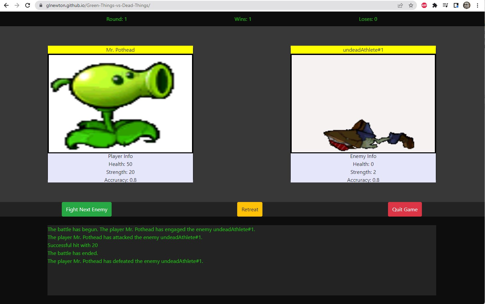
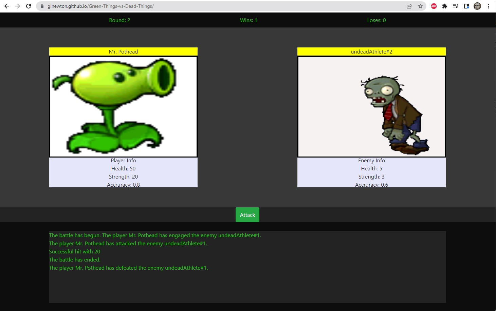
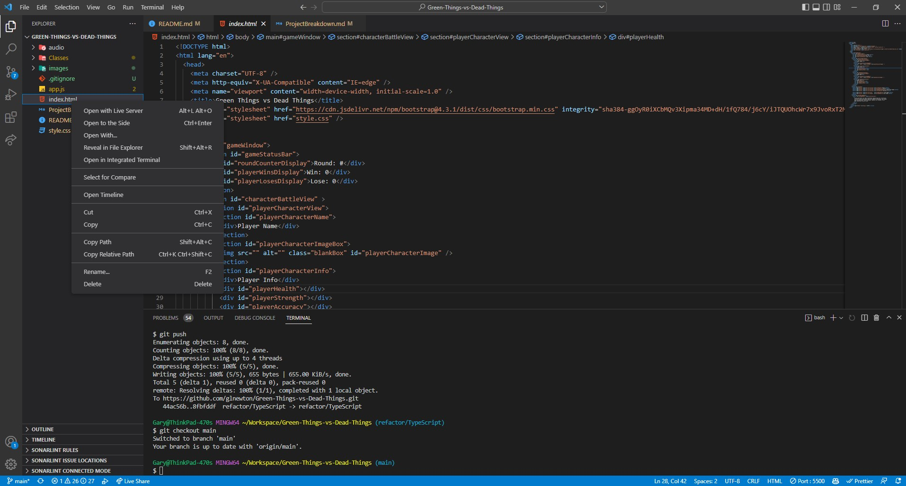

# Green-Things-vs-Dead-Things

## About

A RPG styled character battle demo inspired by a popular game.

[Live Site](https://glnewton.github.io/Green-Things-vs-Dead-Things/)

[Timeline](ProjectBreakdown.md)

## Screenshots

## Build Status

Project is a static HTML/CSS/JS web site that is deployed directly from the GitHub respository via GitHub Pages.

## Code Style

Elements of both functional programming and object-oriented programming are used in this project.

## Technologies, Language Features & Libraries Used

- HTML
- CSS
- JavaScript
- CSS Library: Bootstrap (buttons mainly)
- JS Features: 
    - Classes
    - Modules

## Features

1. Built with HTML, CSS and JavaScript
2. DOM-based 
3. Hosted on GitHub Pages

## Installation Instructions

**Step 1: Clone the repository**

Run the following code in your terminal to download the code:

`git clone https://github.com/glnewton/Green-Things-vs-Dead-Things.git`

**Step 2: Using VSCode, launch the index.html with the Live Server extension.**

## Game Mechanics:

1. Two Players (User vs PC )
2. Win State
3. Lose State
4. Multiple Rounds
5. Exit Game
6. Play Again

## Additional Features

- Responsive mobile design
- Animation(s)
    - Flashing Background Color

## Roadmap

- Add modal introduction and ending
- Add speed, weakness, and special attack to creatures
- Add additional animations
    1. Fade In/Out
    2. Border Flashing
    3. Shaking Image
    4. Screen Dimming
    5. Health Bar
- Refactor with TypeScript

## Resources

- https://medium.com/@meakaakka/a-beginners-guide-to-writing-a-kickass-readme-7ac01da88ab3
